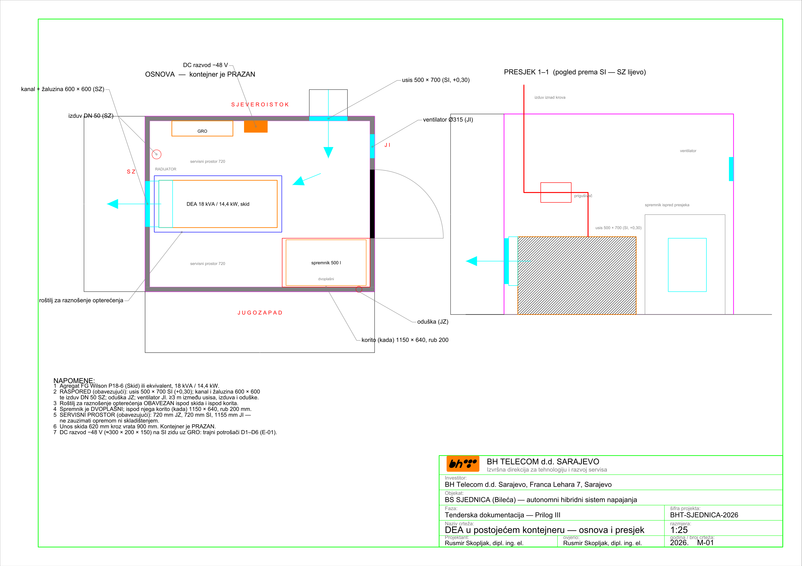
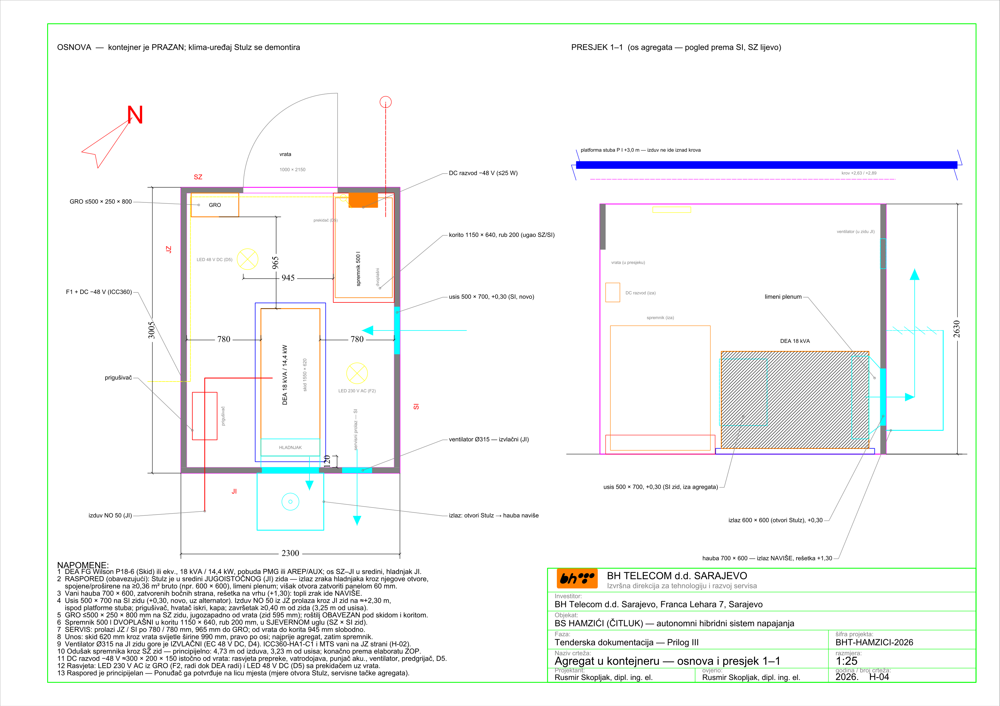
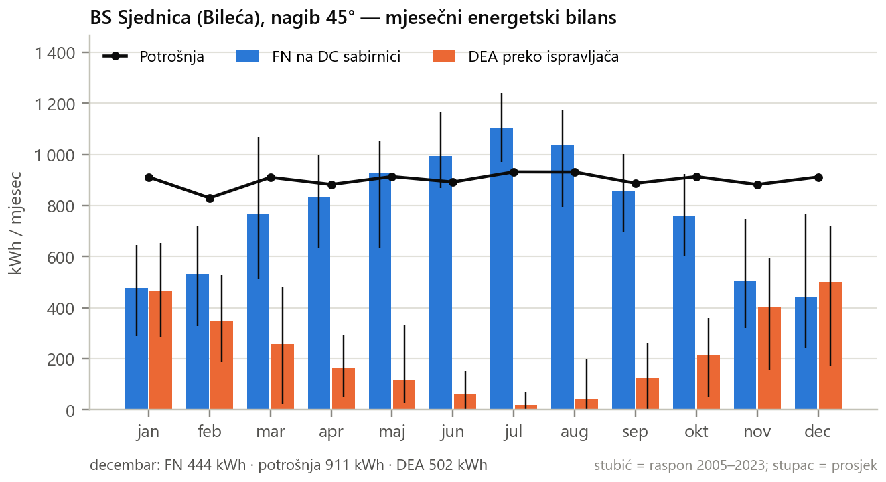
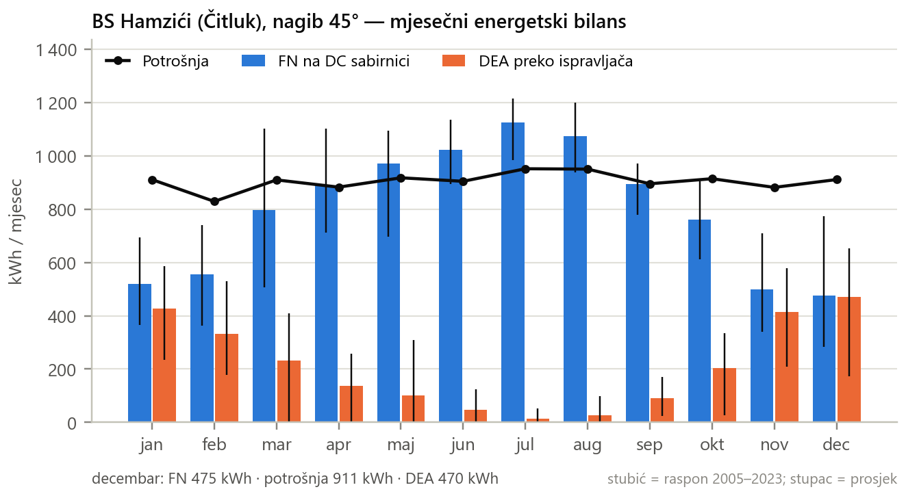
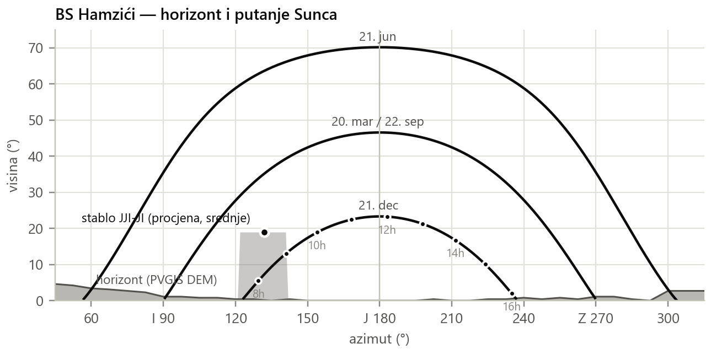

# PRILOG I TD — SPECIFIKACIJA ZAHTJEVA

**Autonomni hibridni sistem napajanja — SJEDNICA (Bileća) i HAMZIĆI (Čitluk)**
LOT 1: nosači fotonaponskih panela · LOT 2: dizel električni agregat u kontejneru —
**svaki LOT obuhvata obje lokacije**

**Verzija:** Rev 1 zajedničke TD, 11.09.2026. (za lokaciju Sjednica nastavak Rev 9)

Ovaj Prilog utvrđuje tehničke zahtjeve i dokaze koje Ponuđač dostavlja **UZ PONUDU**
kao uslov kvalifikacije — ponuda koja ih ne sadrži smatra se neprihvatljivom.

Na obje lokacije se ugrađuje **isti sistem**: 12 fotonaponskih modula na 4 nosača, isti
agregat sa spremnikom goriva u postojećem kontejneru i isto upravljanje. Zahtjevi koji
se razlikuju po lokaciji dati su u zasebnim tačkama ili kolonama, sa oznakom lokacije.

U slučaju neslaganja između dokumenata TD mjerodavni su redom: (1) Tenderska
dokumentacija (TD), (2) Prilog I, (3) Prilog II (Predmjer), (4) Prilog III (grafički
prilozi).

Prilog III sadrži i preuzete stranice ovjerenih projekata lokacija, koje služe samo kao
podloga; **mjerodavan raspored opreme i otvora u kontejneru je onaj sa crteža M-01
(Sjednica) i H-04 (Hamzići).**

---

## 1. Osnovni parametri lokaliteta

| Parametar | BS Sjednica | BS Hamzići |
|---|---|---|
| Lokacija | Sjednica, Bileća, BiH | Hamzići, Čitluk, BiH |
| Koordinate | 42,9448° N · 18,3236° E | 43,2880° N · 17,6248° E |
| Nadmorska visina | 1076 m n.v. | 493 m n.v. |
| Priključak EES | **NE** | **NE** (projektovan 2017., nije izveden) |
| Bilans potrošnje | konstantno, 1180 W nazivno / 1330 W maksimalno, −48 V DC | isto kao Sjednica — privremeno, do izmjerene potrošnje |
| Zakupljeni prostor | ≈150 m² (16,00 × 9,40 m) | 150 m² (12,00 × 12,50 m), k.č. 109/1 K.O. Hamzići |
| Postojeći objekat | AB ploča 5,40 × 5,40 m, ograda h = 2,10 m, kapija 1,00 m | AB ploča 5,40 × 5,40 m, ograda h = 1,80 m, kapija 1,30 m na SZ strani |
| Antenski stub | rešetkasti, h = 38 m, baza 4,20 × 4,20 m | rešetkasti, h = 32 m, baza 3,70 × 3,70 m; platforma na +3,0 m iznad krova kontejnera |
| Kontejner | 3,00 × 2,30 m vanjski, zidni paneli 60 mm, bez opreme; ulazna vrata 900 × 2000 mm na JUGOISTOČNOM (JI) zidu | K2 3,00 × 2,30 m vanjski, zidni paneli 60 mm, **prazan, bez GRO i instalacija**; ulazna vrata 1,00 × 2,15 m na SJEVEROZAPADNOM (SZ) zidu; na JUGOISTOČNOM (JI) zidu, u sredini, klima-uređaj Stulz WDE80 koji se demontira (Tačka 4.8) |
| Nosivost poda kontejnera | 10,00 kN/m² ukupno (g+p), ravnomjerno raspodijeljeno — ovjereni projekat lokacije, „04 AG dio", tačka 4.4.2.3 | 10,00 kN/m² ukupno (g+p) — ovjereni projekat lokacije, AG dio, tačka 4.4.2 |
| Sistem napajanja | Huawei ICC360-HA1-C1 (PowerCube 1000) i MTS9302A, vanjski ormari smješteni uz SJEVEROISTOČNI (SI) zid kontejnera, u sjeni | Huawei ICC360-HA1-C1 (PowerCube 1000) i MTS — zasebna nabavka Naručioca, kao na Sjednici; vanjski ormari na ploči sa JZ strane, iza FN polja |
| Uzemljenje | postojeći prstenasti uzemljivač Fe/Zn 25 × 4 mm | postojeći uzemljivač Fe/Zn 25 × 4 mm: prsten u temeljima stopa stuba i prsten na dubini 0,8 m |
| Orijentacija | kompleks je zakrenut 45° (Google Maps, Naručilac 11.09.2026): vrata JI, hladnjak agregata SZ, FN polje JZ, vanjski ormari SI; crteži su pravougaoni na kompleks, strelica pokazuje pravi sjever (S-01) | kompleks je zakrenut 45° (Google Maps, Naručilac 11.09.2026): vrata i kapija SZ, klima-uređaj Stulz i hladnjak agregata JI, FN polje JZ; ovjereni crtež iz 2017. je zakrenut ≈180°; orijentacija se potvrđuje obilaskom (H-01) |

### 1.1 Klimatski i geotehnički uslovi

| Uticaj | BS Sjednica | BS Hamzići | Napomena |
|---|---|---|---|
| **Vjetar** | **qp ≥ 1,20 kN/m²** (udar 3 s ≈ 45 m/s) | **qp ≥ 1,20 kN/m²** (izvedeno iz ovjerenog projekta 0,69–0,96 kN/m²) | BAS EN 1991-1-4 + BiH NA — **mjerodavno dejstvo**; jedna konstrukcija za obje lokacije |
| Snijeg | μ₁ = 0,4 pri 45°; ≈0,5 m opažene visine → ≈0,6 kN/m² | sk = 2,10 kN/m² (projekat) → ≈0,84 kN/m² na ravni panela | prema BAS EN 1991-1-3 + BiH NA; provjera obavezna, nije mjerodavna |
| **Led** | radijalni 20 mm, gustina 300 kg/m³ | radijalni 20 mm, gustina 500 kg/m³ (projekat stuba) | mjerodavan kao akrecija na profile i spojeve |
| Temperatura | −25 °C do +50 °C | −25 °C do +50 °C; projektni ambijent +40 °C | radni opseg opreme |
| Gustina zraka | 1,04–1,09 kg/m³ | 1,06–1,12 kg/m³ | derating agregata i dimenzionisanje ventilacije |
| Tlo | kamenito (krš); nosivost ≥100 kPa | krš; σdop = 150 kPa, bez podzemne vode (projekat) | Ponuđač potvrđuje geomehaničkim uvidom |
| Smrzavanje | temeljna spojnica ispod dubine smrzavanja | isto | Ponuđač navodi usvojenu dubinu u dnevniku/knjizi |

## 2. Referentni standardi

| Oblast | Standardi |
|---|---|
| Osnove proračuna | BAS EN 1990 |
| Dejstva | BAS EN 1991-1-3 (snijeg), BAS EN 1991-1-4 (vjetar), sa BiH NA |
| Beton i čelik | BAS EN 1992-1-1, BAS EN 1993-1-1, BAS EN 206, EN 10025-2, EN 10219 |
| Geotehnika | BAS EN 1997-1 |
| Izrada čeličnih konstrukcija | EN 1090-1, EN 1090-2 (EXC2) |
| Antikorozivna zaštita | EN ISO 1461 |
| Elektroinstalacije | IEC 60364 (tj. 60364-4-41), BAS EN 60529 |
| Gromobranska zaštita | EN 62305-1 do -4 |
| Prenaponska zaštita | EN 61643-11, EN 61643-21 |
| Fotonaponski sistemi | IEC 62548, IEC 62852 |
| Agregati | ISO 8528-1, ISO 8528-3, ISO 3046-1 |
| Zaštita od požara | važeći propisi RS / FBiH / BiH; elaborat zaštite od požara za svaku lokaciju |

**Dokumentacija proizvođača opreme:** FG Wilson P18-6 (Skid) TDS 2019-08-14; Huawei
PV Module Solution User Manual; Huawei MTS9300A Telecom Power Installation Guide;
Huawei ICC360-HA1-C1 (PowerCube 1000) Installation Guide.

---

## 3. LOT 1 — Infrastruktura fotonaponskih panela (obje lokacije)

Nosači, temelji i uzemljenje su **isti na obje lokacije**. Tačke 3.1–3.6 vrijede za obje;
razlike su u Tački 3.7.

### 3.1 Konfiguracija

| Parametar | Zahtjev |
|---|---|
| Broj PV nosača | 4 odvojena nosača × 3 modula po lokaciji (ukupno 8 kom), u jednom nizu sa razmakom 400 mm, dužina niza 10 312 mm — odvojeni nosači umjesto jednog kontinuiranog polja, radi manjeg opterećenja vjetrom po nosaču (Naručilac 11.09.2026) |
| Broj PV stringova | 2 stringa × 6 modula (Voc ≈309 V, Imp 13,67 A) po lokaciji — po jedan string na svaku od dvije rute PVDB ormara; string se prostire preko dva nosača (PV-1 + PV-2, PV-3 + PV-4) |
| Broj PV modula | 12 × 585 Wp = 7,02 kWp po lokaciji; 3 modula po nosaču, 3 reda × 1 stupac, položeno (landscape) |
| Tip PV modula | Huawei iPV585-M2A (2278 × 1134 × 30 mm) |
| Nagib | fiksno 45° |
| Azimut | 225° (pravi JUGOZAPAD); niz paralelan sa JZ ogradom (Naručilac 11.09.2026) |
| Širina PV polja | 2278 mm (poprečna greda 2891 mm, bočni prepust 306,5 mm) |
| Dužina PV polja po nagibu | 3442 mm (3 × 1134 mm + 2 × 20 mm) |
| Horizontalna projekcija | 2434 mm pri 45° |
| Donja / gornja ivica | **+0,50 m / +2,93 m** |
| Površina izloženosti vjetru | 7,84 m² po nosaču |

### 3.2 Projektna opterećenja konstrukcije

**Izrada konstrukcije:** zahtijeva se **CUSTOM IZRADA** konstrukcije dimenzionisana i
dokazana za stvarna opterećenja i uticaje na lokalitetu. Nijedan kataloški nagib Huawei
nosača tipa A nije usklađen sa qp lokacija (deklarisano 0,52–0,87 kN/m² prema
zahtijevanih 1,20 kN/m²).

| Parametar | Zahtjev |
|---|---|
| Pritisak vjetra | qp ≥ 1,20 kN/m² na obje lokacije |
| Koeficijent sile | cf ≥ 1,5 pri 45° prema EN 1991-1-4 §7.3 |
| Površina izloženosti vjetru | 7,84 m² po nosaču |
| Sila podizanja po nosaču | ≥13,3 kN (GSN, γQ = 1,5 / γG,fav = 0,9) |
| Horizontalna sila po nosaču | ≥10,0 kN (GSN) |
| **Moment prevrtanja po nosaču** | **≥25,7 kNm (GSN)** |
| **Spreg po temeljnoj traci** | **≥16,1 kN** pri razmaku traka 1600 mm |
| Mjerodavno | podizanje (uplift) i prevrtanje, a NE nosivost tla |

### 3.3 Materijal i izrada konstrukcije

| Element | Zahtjev |
|---|---|
| Konstrukcijski čelik | S275JR (S355JR za stubove) prema EN 10025-2 |
| Profili | šuplji profili prema EN 10219; stubovi min. RHS 80 × 80 × 4, rigle min. RHS 60 × 40 × 3, ili presjek sa dokazano najmanje jednakim otpornim momentom |
| Antikorozivna zaštita | vruće cinčanje prema EN ISO 1461, min. 70 µm lokalno / 85 µm srednje (C4) |
| Zavarivanje | EN 1090-2, klasa izvedbe EXC2; zavarivači prema EN ISO 9606-1 |
| Označavanje | CE i izjava o svojstvima prema EN 1090-1 |
| Konstrukcijski vijci | M16 klase 8.8, cinčani, prema EN 15048 |
| Pričvršćenje modula | nehrđajući A2/A4; stezaljke za debljinu modula 30 mm |
| Zaštita od krađe | antitheft matice na stezaljkama modula |
| Moment pritezanja | prema uputstvu proizvođača (45 N·m za Huawei) |

### 3.4 Sidrenje

| Element | Zahtjev |
|---|---|
| Tip | hemijski (epoksidni/vinilesterski) anker M16 ili M20, sa ETA odobrenjem |
| Materijal | vruće cinčan ili nehrđajući A4 |
| Broj | min. 2 ankera po temeljnoj traci, odnosno 4 po nosaču |
| Nosivost | karakteristična sila čupanja ≥30 kN po ankeru |
| Dubina ugradnje | prema ETA za konkretnu podlogu (beton / stijena) |
| **Projektna sila** | ukupno podizanje po nosaču ≥13,3 kN; **sila po traci od momenta prevrtanja ≥16,1 kN** pri razmaku traka 1600 mm — ovo je mjerodavno opterećenje sidrenja |
| Dokazivanje | ispitivanje čupanjem (pull-out) na ≥10 % ugrađenih ankera, min. 2 po nosaču, do 1,5 × projektne sile, uz zapisnik ovjeren od nadzornog organa |

### 3.5 Temelji nosača

| Element | Zahtjev |
|---|---|
| Beton | C30/37, klasa izloženosti XC4 + XF3, aerant 4–6 %, Dmax 16, S3 |
| Podložni beton | C12/15, d = 50 mm |
| Armatura | B500B, zaštitni sloj ≥50 mm |
| Geometrija | 2 trake po nosaču (×4 nosača = **8 traka po lokaciji**), 400 mm (gore) / 500 mm (dolje) × 2600 mm, **pune dubine 900 mm**, razmak 1600 mm, upravno na niz (pravac JZ–SI) |
| **Zapremina** | **1,053 m³ po traci → 8,42 m³ po lokaciji** |
| Smještaj | **IZVAN ograđenog platoa**, na JZ strani ograde (Tačka 3.7) |
| Dubina smrzavanja | temeljna spojnica ispod dubine smrzavanja; Ponuđač navodi vrijednost |

**Traka se betonira punom dubinom rova.** Vlastita težina trake je dio dokaza
sigurnosti na podizanje: `1,053 m³ × 24 kN/m³ × 0,9 = 22,7 kN` prema sprezi od 16,1 kN
po traci. Traka manje zapremine tu provjeru ne zatvara vlastitom težinom.

### 3.6 Uzemljenje (LOT 1)

- povezivanje **sva četiri nosača** na svakoj lokaciji na postojeći uzemljivač Fe/Zn 25 × 4 mm
- vodič: bakarno uže ≥50 mm² prema EN 62305-3, Tabela 7, otporno na UV i ukopavanje
- **NIJE dozvoljen** H07V-K 25 mm² (unutrašnji instalacioni vodič)
- bimetalni (Cu/Fe-Zn) ukrsni komadi otporni na galvansku koroziju
- kontinuitet spojeva ≤0,1 Ω; ukupni otpor uzemljenja ≤10 Ω
- DC kablovi na razmaku ≥0,5 m od odvoda gromobranske instalacije
- FN polja su na obje lokacije unutar zone zaštite antenskog stuba (metoda kotrljajuće
  sfere, LPL I) — dodatne hvataljke nisu potrebne
- **Hamzići:** svih 8 temeljnih traka u JZ pojasu presijeca dva postojeća prstena uzemljivača Fe/Zn 25 × 4 mm
  na dubini 0,8 m (1,05 m i 2,30 m od ivice ploče, ovjereni `3.6.9 Plan uzemljivača`).
  Ponuđač ih locira i otkopava, pa ih premješta ispod ili oko trake ili premošćuje istim
  materijalom — prsten se ne prekida trajno; otpor uzemljenja mjeri prije i poslije radova

### 3.7 Posebno po lokaciji

| Parametar | BS Sjednica | BS Hamzići |
|---|---|---|
| Kota ograde | h = 2,10 m (ovjereni `04 Ograda`) | h = 1,80 m od ploče (ovjereni `04_Ograda`); teren oko ploče je na −0,20 m, pa je ograda 2,00 m iznad terena |
| Nadvišenje ograde | 0,83 m | 0,93 m |
| Raspoloživi prostor | na JZ strani ograde, unutar zakupljene parcele 16,00 × 9,40 m; niz 10 312 mm | pojas na JZ strani ploče dubine 3300 mm i dužine 12,50 m, unutar zakupa 12,00 × 12,50 m — projekcija polja 2434 mm i trake 2600 mm staju sa po 350 mm od granice zakupa i od ploče; niz 10 312 mm centriran na ploču |
| Položaj nosača | niz paralelan sa JZ ogradom; Ponuđač utvrđuje odmak od ograde tako da ravan panela nigdje ne dodiruje ogradu, a konstrukcija ostane unutar parcele | nosači okrenuti na JZ (azimut 225°), niz paralelan sa granicom zakupa; iza niza, na ploči sa JZ strane, stoje vanjski ormari ICC360-HA1-C1 i MTS (0,85 m slobodno ispred njih); položaj potvrđuje Ponuđač geodetskim snimanjem |
| Prepreke | nema | listopadno stablo JJI–JI od stuba (≈7–9 m, 15–20 m, izvan zakupa) zasjenjuje polje samo u zimskim jutrima (do ≈2 % decembarske proizvodnje; polje okrenuto na JZ ga uglavnom izbjegava); stablo se ne uklanja |
| Grafički prilozi | S-01, S-02, S-03 | H-01, H-02, H-03 |

---

## 4. LOT 2 — Dizel električni agregat i instalacije (obje lokacije)

Na svakoj lokaciji se u postojeći kontejner ugrađuje po jedan agregat sa spremnikom
goriva. Tačke 4.1–4.7 vrijede za obje lokacije; raspored otvora, izduv i instalacije
razlikuju se po lokaciji i dati su u Tačkama 4.3–4.5; Tačka 4.8 je samo za Hamziće.

### 4.1 Agregat

| Parametar | Zahtjev / referentna vrijednost |
|---|---|
| Snaga | 18 kVA / 14,4 kW standby, 400/230 V, 50 Hz |
| Referentni tip | FG Wilson P18-6 ili ekvivalent |
| Motor | Perkins 404D-22G1 ili ekvivalent, 4-cilindarski, 2,2 l, 1500 o/min |
| Izvedba | za montažu u prostor (skid, bez vlastitog kućišta) |
| Dimenzije | 1550 × 620 × 1020 mm (referentno ±5 %) |
| Masa | 365 kg suho / 372 kg mokro (referentno) |
| Derating | Sjednica: 1076 m n.v., Hamzići: 493 m n.v., temperatura okoline do +40 °C (ISO 3046-1); Ponuđač dostavlja derating proizvođača za obje lokacije |
| **Uzbuda (OBAVEZNO)** | nezavisna pobuda — **PMG ili AREP/AUX** namotaj; trajna struja kratkog spoja **≥3 × In (≈78 A)** u trajanju ≥10 s prema ISO 8528-3. Standardna SHUNT pobuda **NIJE prihvatljiva** |
| Antivibracioni elementi | gumeno-metalni oslonci, vlastita frekvencija ≤8 Hz, statički progib ≥5 mm, između skida i roštilja iz Tačke 4.2; **svi priključci na motor elastični** — izduv, hladnjak i **oba voda goriva** |
| Hladni start | predgrijač rashladne tečnosti na DC, napojen iz DC razvoda −48 V (Tačka 4.5); uključuje ga kontroler agregata samo za kratko predgrijavanje prije starta pri niskoj temperaturi; uz to pomoćna sredstva za hladni start prema proizvođaču i zimsko dizel gorivo prema EN 590. Grijač prostora se ne predviđa — agregat je jedini izvor izmjeničnog napona |

{width=60%}

{width=42%}

### 4.2 Spremnik goriva i oslanjanje opreme

- metalni, **dvoplašni**, zapremine **500 l**, sa nivo sondom i detekcijom curenja
  goriva u međuplaštu
- referentne dimenzije 1050 × 600 × 1310 mm, masa cca 170 kg — pun ≈590 kg na
  0,63 m² = 9,2 kN/m²; unutar projektnih 10,00 kN/m²
- **OBAVEZAN čelični ram/roštilj za raznošenje opterećenja** pod DEA i pod koritom sa
  spremnikom, sa prenosom na primarne nosače podne konstrukcije. Opterećenja su
  koncentrisana na mali broj sekundarnih nosača (HOP 100 × 50 × 3 na 0,51 m), dok se
  10,00 kN/m² odnosi na ravnomjerno raspodijeljeno opterećenje
- **sekundarnu zaštitu čini međuplašt** dvoplašnog spremnika sa sondom za detekciju
  curenja, pa tankvana zapremine ≥110 % **NIJE zahtijevana**. Ispod spremnika se
  izvodi **prihvatno korito (kada) 1150 × 640 mm, visina ruba 200 mm**, za prihvat
  kapanja i prosipanja, sa vidljivim najnižim mjestom za kontrolu i pražnjenje
- vanjski priključak za tankanje sa zaštitom od statičkog elektriciteta i
  sprječavanjem prelijevanja
- odušna cijev izvan kontejnera, sa plamenobranom, udaljena ≥3 m od izduva i usisa
  zraka
- protupožarni ventil na izlazu iz spremnika (topljivi osigurač ili solenoid),
  aktiviran požarom i E-STOP-om
- napajanje motora gorivom Cu cijevima NO 8 mm (polazni i povratni vod), sa
  **fleksibilnim umetkom na oba voda neposredno uz motor**
- sifon protiv povratnog toka

{width=55%}

{width=62%}

### 4.3 Ventilacija i hlađenje

Dimenzionisano prema tehničkom listu proizvođača. Mjerodavno ograničenje je
**maksimalni vanjski otpor strujanju zraka od 125 Pa** za cjelokupnu putanju.

| Parametar | Vrijednost |
|---|---|
| Zrak hladnjaka | 1980 m³/h (33 m³/min) — ostvaruje vlastiti ventilator hladnjaka; korigovano na gustinu lokacije: Sjednica 2151 m³/h, Hamzići 2206 m³/h |
| Zrak za sagorijevanje | 90 m³/h; max. otpor usisa 3 kPa |
| Maks. vanjski otpor | **125 Pa** (ukupno: usis + kanal + izlaz) |
| **Toplota u prostor** | **5,8 kW** (uz 15,2 kW odvedenih rashladnom tečnošću i uljem) |
| Usisna žaluzina | 500 × 700 mm (v ≈ 3,6 m/s, Δp ≈ 18 Pa) |
| Izlaz toplog zraka | slobodna površina ≥0,18 m² (bruto ≥0,36 m², npr. 600 × 600 mm; v ≈ 3,5 m/s) |
| Ventilator prostora | 1200 m³/h, Ø315, **48 V DC (EC)**, napajan sa DC razvoda −48 V (Tačka 4.5); vođen termostatom dok agregat ne radi (i za hlađenje nakon zaustavljanja); kontroler DEA ga isključuje dok agregat radi, jer tada prostor ventilira struja zraka hladnjaka; blokiran sa aktiviranjem gašenja požara |
| Provjera | Izvođač dostavlja proračun pada pritiska ukupne putanje za svaku lokaciju |

Otvori se izvode kroz **ZIDNE PANELE** kontejnera. Raspored je ukrsni. Nije dozvoljeno
izvesti usis, izlaz i izduv na istom zidu, niti dovod zraka kroz ulazna vrata.

#### 4.3.A Raspored otvora — BS Sjednica (crtež M-01)

| Element | Zid i položaj |
|---|---|
| Usisna žaluzina 500 × 700 | **SJEVEROISTOČNI (SI) zid, jugoistočni kraj**; donja ivica +0,30 m od poda. SI strana je zasjenjena i daje najhladniji usisni zrak; žaluzina se postavlja jugoistočno od vanjskih ormara ICC360-HA1-C1/MTS9302A |
| Kanal hladnjaka + izlazna žaluzina 600 × 600 | **SJEVEROZAPADNI (SZ) zid**, na osi hladnjaka agregata; kanal najkraćim putem od hladnjaka kroz zid, **razvijena površina ≈1,0 m²** |
| Izduv | uz **SZ zid**, završetak iznad krova (Tačka 4.4) |
| Odušna cijev spremnika | **JUGOZAPADNI (JZ) zid**, jugoistočni kraj |
| Ventilator prostora Ø315 | **JUGOISTOČNI (JI) zid**, gore (donja ivica ≈+1,75 m), sjeveroistočno od ulaznih vrata |
| Minimalna razdaljina | ≥3 m prostorno između usisa zraka, izduva i odušne cijevi |

Ukrsno strujanje **usis SI → agregat → izlaz SZ**. Nije dozvoljeno usmjeriti topli
zrak ili izduv prema SI strani, gdje su vanjski ormari i usis svježeg zraka.

{width=100%}

#### 4.3.B Raspored otvora — BS Hamzići (crtež H-04)

Izlaz toplog zraka hladnjaka ide kroz **postojeće otvore klima-uređaja Stulz** u
sredini jugoistočnog (JI) zida (Tačka 4.8). Projekat klimatizacije iz 2017. predviđa dva otvora
300 × 700 mm; stvarne otvore ugrađenog uređaja Ponuđač mjeri pri obilasku.

| Element | Zid i položaj |
|---|---|
| Usisna žaluzina 500 × 700 | **SJEVEROISTOČNI (SI) zid**, novi otvor uz alternator (SZ kraj agregata), neposredno jugoistočno od korita spremnika; donja ivica +0,30 m od poda |
| Plenum hladnjaka + izlaz | **JUGOISTOČNI (JI) zid, u sredini** — kroz postojeće otvore klima-uređaja Stulz, spojene/proširene na **≥0,36 m² bruto**, sa fiksnom žaluzinom; nekorišteni dio otvora zatvara se sendvič panelom 60 mm iste izvedbe kao zid; plenum od pocinčanog lima, razvijena površina ≈1,5 m² |
| Hauba | vani na JI zidu, 700 × 600 mm, od pocinčanog lima, zatvorenih bočnih strana i dna, sa rešetkom na vrhu (≈+1,30 m): topli zrak ide **NAVIŠE**, dalje od FN polja (JZ strana) i od ormara Huawei; ≥1,0 m od nogu stuba |
| Izduv | iz JZ prolaza kroz **JUGOISTOČNI (JI) zid**, jugozapadno od haube, horizontalno na ≈+2,30 m, ispod platforme stuba; prigušivač u JZ prolazu; završetak ≥0,40 m od zida (Tačka 4.4) |
| Agregat | duža osa **SZ–JI**, u sredini kontejnera, hladnjak na JI; prolazi po 0,78 m na SI i JZ strani (u JZ prolazu su izduv i prigušivač), SZ kraj 0,97 m do GRO — Ponuđač potvrđuje da su servisne tačke agregata dostupne sa SI strane i SZ kraja |
| Spremnik 500 l | u **SJEVERNOM uglu** (SZ × SI zid, prema pravom sjeveru — Naručilac 11.09.2026), uz SZ kraj agregata; od vrata do korita ostaje 0,945 m slobodnog prolaza za unos agregata |
| Odušna cijev spremnika | principijelno kroz **SJEVEROZAPADNI (SZ) zid**, sjeveroistočno od ulaznih vrata, pa stojećom cijevi između kontejnera i SZ ograde, izvan krila vrata, završetak na +2,80 m; ≥3 m od završetka izduva i od usisne žaluzine, ≥1 m od ormara Huawei; konačno prema elaboratu zaštite od požara |
| Ventilator prostora Ø315 | **JUGOISTOČNI (JI) zid**, gore, sjeveroistočno od haube; **izvlačni** (izbacuje zrak iz prostora) |
| GRO | **SJEVEROZAPADNI (SZ) zid**, jugozapadno od ulaznih vrata; raspoloživi zid je 0,595 m, pa je **širina GRO ≤0,50 m** |
| DC razvod −48 V | **SZ zid**, sjeveroistočno od ulaznih vrata, iznad spremnika (≈300 × 200 × 150 mm) |
| Huawei ICC360-HA1-C1 i MTS | vanjski ormari na ploči sa JZ strane kontejnera, između dvije JZ noge stuba, iza FN polja i u njegovoj sjeni; vrata prema kontejneru, 0,85 m slobodno ispred ormara; napajanje iz GRO (izvod F1) i −48 V kroz JZ zid; kratka DC trasa od FN polja do PVDB uz ICC360; tip i mjere MTS potvrđuje Naručilac (principijelno) |
| Minimalna razdaljina | ≥3 m prostorno između usisne žaluzine, završetka izduva i odušne cijevi (H-04: završetak izduva–usis 3,25 m); izvlačni ventilator je izlazni otvor i ne ulazi u ovaj uslov |

Ukrsno strujanje **usis SI → agregat → izlaz JI, hauba naviše**; hladnjak agregata je
uz JI zid, na mjestu otvora klima-uređaja, a hauba topli zrak usmjerava naviše. Izduv
izlazi na JI strani, jugozapadno od haube, dalje od ulaznih vrata (SZ), od usisa (SI) i
od ormara (JZ). Mjere otvora Stulz se uzimaju pri obilasku, pa je raspored na crtežu H-04 principijelan —
Ponuđač ga potvrđuje na licu mjesta.

{width=100%}

### 4.4 Izduvni sistem

| Parametar | Vrijednost |
|---|---|
| Protok izduvnih gasova | 192 m³/h (3,2 m³/min) pri 413 °C |
| Maks. dozvoljeni protutlak | 10,2 kPa |
| **Dijametar** | **NO 50** — pri 192 m³/h i 413 °C brzina je 27,2 m/s (< 30 m/s), protutlak ≈1,9 kPa (Sjednica) i ≈1,6 kPa (Hamzići) uz dozvoljenih 10,2 kPa. Prečnik određuje brzina, ne protutlak |
| Prigušivač | industrijski; **hvatač iskri obavezan** |
| Fleksibilni priključak | neposredno iza motora |
| Izolacija | kamena vuna d = 50 mm + Al lim d = 1 mm; boja otporna na 600 °C |
| Provjera | Ponuđač dostavlja proračun protutlaka za svaku lokaciju |

| Trasa i završetak | BS Sjednica | BS Hamzići |
|---|---|---|
| Trasa | 1 m od elastičnog umetka do prigušivača sa jednim lukom 90°; do 4 m od prigušivača do izlaza, uspon uz **SZ zid** kontejnera | ≈1 m do prigušivača u JZ prolazu, zatim ≈1,5 m do **JI zida** i horizontalno kroz njega na visini ≈+2,30 m, sa termoizolacionom čahurom u prolazu kroz zid |
| Završetak | **iznad krova, usmjeren naviše**, sa kapom protiv upada padavina, ≥3 m od usisa zraka i odušne cijevi | **horizontalno, usmjeren na JI**, ≥0,40 m od zida, ispod platforme stuba (+3,0 m) koja je iznad krova kontejnera — završetak iznad krova nije moguć; kapa protiv padavina, ≥3 m od usisa zraka i odušne cijevi; ne usmjeravati na noge stuba ni kablove |
| Izolacija | ≈3,0 m² | ≈2,5 m² |

### 4.5 Elektroinstalacije i zaštite

Zahtijeva se **NEZAVISNA POBUDA** generatora (PMG ili AREP/AUX) sa 3 × In u trajanju
≥10 s (Tačka 4.1), kao i zaštita zaštitnom strujnom sklopkom (RCD) kao glavnim
sredstvom zaštite od indirektnog dodira.

| Element | Zahtjev |
|---|---|
| Nazivna struja | **In = 26,0 A** pri 18 kVA / 400 V |
| Struja kvara (SHUNT) | prva poluperioda ≈333 A (12,8 × In) → prelazna ≈169 A (6,5 × In) → **TRAJNA ≈13 A (0,5 × In)** — ne aktivira zaštitu (**ne zadovoljava**) |
| **Struja kvara (PMG/AREP)** | **≥78 A (3 × In) trajno ≥10 s — ZAHTIJEVANO** |
| Sistem zaštite | TN-S, jedinstvena tačka spajanja N i PE u novom GRO |
| Glavna zaštita | 4p RCD 63 A / 300 mA, S-tip (selektivna) |
| Krajnji strujni krugovi | RCBO 16 A / 30 mA, tip A (utičnice, rasvjeta) |
| Sklopka izvora | 4p 63 A, položaji 1 – agregat / 0 – isključeno / 2 – rezerva |
| SPD, AC strana | **tip 1 + 2** (Iimp ≥12,5 kA) — objekti imaju vanjski LPS |
| SPD, DC strana | tip 2 po stringu (Iimp ≥5 kA, Ucpv ≥425 V), na PVDB i na polju |
| SPD, signalni vodovi | prema EN 61643-21 (obavezno za stubove h = 38 m i h = 32 m) |
| AC kablovi | bezhalogeni, CPR ≥ Cca-s1b,d1,a1 |
| DC kablovi | H1Z2Z2-K 6 mm²; priključak na iSSU presjekom 4 mm² |
| Otpor uzemljenja | ≤10 Ω |

| Postojeće stanje i novi GRO | BS Sjednica | BS Hamzići |
|---|---|---|
| Postojeći strujni krugovi | snimiti stanje i prevezati postojeće krugove u novi GRO; signalna rasvjeta antenskog stuba (K7) prelazi na DC razvod −48 V | kontejner je **prazan — nema GRO ni krugova**: nova rasvjeta (2 LED svjetiljke IP65 ≥1500 lm; jedna je za 48 V DC na DC razvodu, pa je svjetlo dostupno i kad agregat ne radi), 2 utičnice 230 V/16 A IP44, kablovi u kanalicama; postojeća svjetiljka za obilježavanje stuba prelazi na DC razvod −48 V |
| Klima-uređaj | — | **bez kruga za klima-uređaj** (demontira se, Tačka 4.8) |
| Smještaj GRO | SI zid, uz vanjske ormare koje napaja | SZ zid, jugozapadno od ulaznih vrata; **širina ≤0,50 m** (raspoloživi zid 0,595 m); ormari Huawei su vani, na JZ strani (Tačka 4.3.B) |
| Grafički prilog | E-01 | H-05 |

**Trajni potrošači — napajanje sa −48 V DC (obje lokacije).** Agregat je jedini izvor
izmjeničnog napona: izvodi GRO (rasvjeta, utičnice, pomoćni potrošači agregata, napajanje
ispravljača) su pod naponom samo dok agregat radi. Potrošači koji moraju raditi i kad
agregat ne radi napajaju se sa −48 V DC iz ormara Huawei ICC360-HA1-C1 — sa slobodnog DC
izvoda sa vlastitim zaštitnim prekidačem — preko novog **DC razvoda −48 V** u kontejneru:

| Potrošač na DC razvodu | Zahtjev |
|---|---|
| Svjetiljka za obilježavanje antenskog stuba | LED za 48 V DC, niskog intenziteta, sa foto-senzorom i nadzorom ispada prema SMU, umjesto postojeće svjetiljke; ili postojeća svjetiljka preko DC/AC pretvarača ≤100 W |
| Vatrodojavna centrala | preko DC/DC pretvarača na nazivni napon centrale; centrala zadržava vlastite akumulatore prema EN 54-4 |
| Punjač akumulatora za start agregata | DC/DC 48 V → 12/24 V prema agregatu, sa strujnim ograničenjem i signalizacijom |
| Ventilator prostora | 48 V DC (EC), Tačka 4.3 |
| Predgrijač rashladne tečnosti agregata | DC — direktno 48 V ili preko DC/DC odgovarajuće snage; uključuje ga kontroler agregata samo za kratko predgrijavanje prije starta pri niskoj temperaturi (Tačka 4.1), ne radi trajno; ≈0,1 kWh po startu |
| Rasvjeta kontejnera | najmanje jedna LED svjetiljka 48 V DC sa prekidačem uz vrata — svjetlo i kad agregat ne radi |
| **Ukupna trajna potrošnja** | **≤25 W prosječno** (bez rasvjete kontejnera, koja radi samo pri obilasku); Ponuđač dostavlja proračun potrošnje. Energetski bilans (Tačka 8) računa sa 45 W pomoćne potrošnje na −48 V: 20 W za SMU, BMS i ispravljače u mirovanju i 25 W za trajne potrošače |

### 4.6 Parametriranje upravljanja i nadzora (DEA + PV + baterije)

- start agregata prema **stanju napunjenosti baterija (SoC)**, a ne prema ispadu mreže
  — lokacije nemaju priključak EES
- **ograničenje ulazne snage ispravljačkog sistema na maks. 9,5 kW dok agregat radi.**
  Derativana prime snaga agregata je 11,6 kW na Sjednici i 12,3 kW na Hamzićima, a
  neograničen ispravljački sistem vuče ≈12,5 kW. Granica ujedno drži agregat iznad 30 %
  opterećenja i sprječava mokri rad motora
- **parametriranje SMU za minimalan rad agregata (OBAVEZNO)** — dokazuje se protokolom
  iz Tačke 5, stavka 12:
  - start agregata pri dubini pražnjenja baterija **DOD 85 %** (SoC 15 %)
  - zaustavljanje agregata pri **SoC 60 %** — ostatak punjenja preuzima fotonaponsko
    polje; punjenje baterija agregatom do vrha povećava rad agregata za 10–16 %
  - struja punjenja baterija podešena tako da ne ograničava agregat ispod 9,5 kW: na
    najveću vrijednost koju dozvoljava BMS baterijskih modula (proračun pretpostavlja
    0,5 C), uz pisanu potvrdu proizvođača
  - najkraće vrijeme rada agregata po startu **1 h**
- prijenos alarma u sistem daljinskog nadzora: rad agregata, kvar, nivo goriva,
  curenje goriva, požar, temperatura prostora
- upravljačka jedinica kompatibilna sa postojećim sistemom napajanja (modul GIM01C1,
  AC ulazni modul AIU03)

### 4.7 Zaštita od požara

- elaborat zaštite od požara za prostor sa 500 l dizel goriva, za svaku lokaciju —
  tokom primopredaje
- detekcija: dimni i termički detektori; detekcija CO i NO₂
- automatsko gašenje sredstvom za klasu B, sa **blokadom ventilacije pri aktivaciji**
- protupožarni ventil na izlazu iz spremnika
- E-STOP izvan kontejnera pored ulaznih vrata, prema ISO 13850 kategorija 0
- oznake opasnosti, zabrana pušenja, oznaka kapaciteta goriva
- najmanje dva aparata za gašenje odgovarajuće klase

Elaborat zaštite od požara, protupožarni ventil na spremniku i blokada ventilacije pri
aktivaciji gašenja **zasebno su iskazani u Prilogu II**.

### 4.8 Demontaža klima-uređaja Stulz — samo BS Hamzići

- postojeći kompaktni zidni klima-uređaj **Stulz WDE80** (8 kW, rashladni medij R407C) na
  jugoistočnom (JI) zidu kontejnera, u sredini, se odspaja (230 V AC, 48 V DC, signalizacija) i demontira
  **bez otvaranja rashladnog kruga**
- uređaj se pakuje za transport, utovara i prevozi u skladište **BH Telecom d.d.,
  Alipašino Polje, Sarajevo**, uz istovar i **zapisnik o primopredaji** (tip, serijski
  broj, stanje)
- otvori u zidu ostaju za izlaz toplog zraka agregata (Tačka 4.3.B); natpisnu pločicu i
  mjere otvora Ponuđač očitava pri obilasku lokacije

---

## 5. Dokazi koji se dostavljaju

Dokazi koji se dostavljaju **uz ponudu** nose oznaku **PONUDA**; dokazi koji se
dostavljaju **u toku realizacije** nose oznaku **REALIZACIJA**; dokazi koji se
dostavljaju komisiji **tokom primopredaje** nose oznaku **PRIMOPREDAJA**. Dokazi iz
realizacije i primopredaje dostavljaju se **za svaku lokaciju**.

| Br. | Dokaz | LOT | Oznaka |
|---|---|---|---|
| 1 | Statički proračun nosive konstrukcije i temelja za qp ≥ 1,20 kN/m² pri 45°, ovjeren i potpisan od ovlaštenog inženjera, sa dokazom na podizanje i prevrtanje — za obje lokacije | 1 | REALIZACIJA |
| 2 | Tehnički nacrti konstrukcije i temelja | 1 | PONUDA |
| 3 | Izjava o svojstvima prema EN 1090-1 i klasa izvedbe EXC2 | 1 | REALIZACIJA |
| 4 | Atesti materijala (čelik) i potvrda o vrućem cinčanju (debljina sloja) | 1 | REALIZACIJA |
| 5 | ETA certifikat i proračun za hemijska sidra | 1 | REALIZACIJA |
| 6 | Zapisnik o ispitivanju ankera na čupanje (min. 10 %), po lokaciji | 1 | REALIZACIJA |
| 7 | Tehnički list (TDS) agregata sa dokazom o PMG/AREP nezavisnoj pobudi (3 × In, ≥10 s) | 2 | PONUDA |
| 8 | Proračun pada pritiska ventilacije i protutlaka izduvnog sistema, po lokaciji | 2 | REALIZACIJA |
| 9 | Elaborat zaštite od požara za prostor sa rezervoarom 500 l, po lokaciji | 2 | REALIZACIJA |
| 10 | Atesti i certifikati za elektro opremu, CPR kablove i prenaponsku zaštitu (SPD) | 2 | REALIZACIJA |
| 11 | Ispitni protokoli elektroinstalacija i otpora uzemljenja (≤10 Ω), po lokaciji | 2 | PRIMOPREDAJA |
| 12 | Protokol o parametriranju i funkcionalnom ispitivanju integracije DEA–PV–baterija, po lokaciji, uključujući postavljeno ograničenje od 9,5 kW, start pri DOD 85 %, stop pri SoC 60 %, struju punjenja uz potvrdu proizvođača baterija i najkraće vrijeme rada | 2 | PRIMOPREDAJA |
| 13 | Zapisnik o primopredaji demontiranog klima-uređaja Stulz WDE80 u skladištu Alipašino Polje (Hamzići) | 2 | REALIZACIJA |

## 6. Ispitivanja i puštanje u rad

Ispitivanja se izvode **na svakoj lokaciji**.

| Ispitivanje | Kriterij |
|---|---|
| Otpor uzemljenja | ≤10 Ω |
| Kontinuitet zaštitnih vodiča | ≤0,1 Ω po spoju |
| Ispitivanje čupanja ankera | ≥10 % ankera, do 1,5 × projektne sile |
| Funkcionalno ispitivanje RCD | vrijeme i struja isključenja prema IEC 61008/61009 |
| Ispitivanje ventilacije | izmjereni pad pritiska ≤125 Pa |
| Funkcionalno ispitivanje agregata | automatski start/stop, zaštite, alarmi |
| Probni rad | 72 h neprekidnog rada sa simulacijom opterećenja |
| Mjerenje temperature prostora | pri radu agregata na nazivnom opterećenju |

## 7. Garancija

- garantni period minimalno **24 mjeseca** od zapisnika o primopredaji bez primjedbi
- postgarantni period minimalno **5 godina**
- spisak preporučenih rezervnih dijelova za 500 h rada agregata, za svaku lokaciju
- dokumentacija izvedenog stanja i uputstva za pogon i održavanje, za svaku lokaciju

---

## 8. Očekivani energetski bilans (informativno)

Satna simulacija energetskog bilansa na −48 V DC sabirnici za 19 godina (2005–2023) za
svaku lokaciju: ozračenje iz PVGIS-SARAH3, FN lanac sa gubicima po komponentama
(uključujući krivulju efikasnosti iSSU S4875G2), baterije 48,6 kWh (6 × 150 Ah), pomoćnu
potrošnju od 45 W sa trajnim potrošačima iz Tačke 4.5 i agregat preko ispravljača
ograničenih na 9,5 kW, uz parametriranje SMU iz Tačke 4.6. Metoda, provjera
prema PVGIS-u, gubici i osjetljivost na postavke su u proračunima lokacija, dio A.6.
**Vrijednosti su informativne i ne mijenjaju zahtjeve Tačaka 3 i 4.**

Polja su na obje lokacije okrenuta na **pravi jugozapad (azimut 225°)**, u jednom nizu
paralelnom sa JZ ogradom (Naručilac 11.09.2026). Okrenuta na jug (180°), ista polja bi
dala ≈9 % više energije godišnje i ≈21 % više u decembru, a agregat bi radio ≈50 h
godišnje manje. Očekivani rad agregata je zato na obje lokacije iznad cilja od 250 h
godišnje iz RFI; to je svjesno prihvaćena cijena orijentacije JZ (proračuni lokacija,
dio A.6).

| Pokazatelj | BS Sjednica | BS Hamzići |
|---|---|---|
| FN proizvodnja na DC sabirnici | ≈9 240 kWh/god (1 317 kWh/kWp) | ≈9 580 kWh/god (1 365 kWh/kWp) |
| Potrošnja | ≈10 790 kWh/god | ≈10 860 kWh/god |
| Decembar: FN / potrošnja | ≈440 / ≈910 kWh | ≈480 / ≈910 kWh |
| Solarni udio u potrošnji | 74,7 % | 77,0 % |
| **Rad agregata** | **≈300 h/god**; u 9 od 10 godina do ≈360 h; najviše ≈380 h | **≈270 h/god**; u 9 od 10 godina do ≈320 h; najviše ≈350 h |
| Startova agregata | ≈110 godišnje, najviše ≈130 | ≈100 godišnje, najviše ≈120 |
| **Potrošnja goriva** | **≈990 l/god**; spremnik od 500 l dopunjava se dva do tri puta godišnje | **≈900 l/god**; spremnik od 500 l dopunjava se dva puta godišnje |
| Nepokrivena potrošnja | 0 | 0 |

Bez parametriranja iz Tačke 4.6 (zaustavljanje pri SoC 90 %, uobičajena struja
punjenja) agregat bi radio ≈330 h i trošio ≈1 090 l godišnje na Sjednici, odnosno ≈300 h
i ≈1 000 l na Hamzićima. Na Hamzićima vrijednosti važe bez zasjenjenja stablom; sa
stablom rad agregata raste za 1–10 h godišnje.

{width=100%}

{width=100%}

{width=100%}
